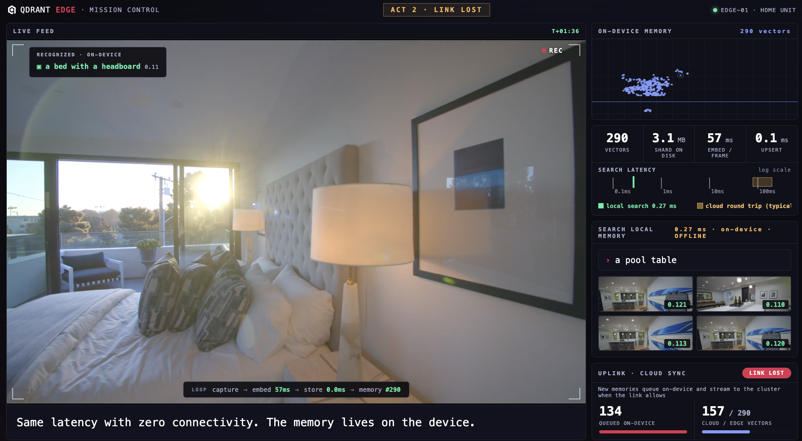

# Qdrant Edge Demo: Robot Mission Control

An interactive demo of [Qdrant Edge](https://qdrant.tech/edge/): an in-process
vector search engine running inside one Python process, with no server and no
network in the loop.



A home robot patrols a house while every captured frame is embedded on-device
and stored in a Qdrant Edge shard. While the 2:33 patrol plays, you drive:

- **Search the robot's memory.** Type anything you remember from the feed and
  press Enter, or use the suggestion chips (they unlock as the robot sees
  things). Searches run against the local shard in under a millisecond; weak
  matches are dimmed and flagged so you can tell a hit from a guess.
- **Cut the uplink.** Press Cut Link and watch the loop keep running at full
  speed while the sync queue grows on-device. Search still works offline.
  Restore the link and the cloud catches up in seconds.
- **Teach a concept.** Type a phrase into the recognition HUD ("a surfboard") and the robot starts watching for it immediately: one text
  embedding, no retraining. Its live score is pinned to the HUD.
- **Explore the memory map.** Every dot is a stored vector; hover to see the
  exact moment it remembers. Click any search result to enlarge it.

After the mission ends the memory stays searchable; Replay Mission starts a
fresh run. Append `?auto` to the URL for a self-playing scripted version
suited to screen recording.

Everything on screen is real work: real SigLIP2 embeddings, a real Edge shard, real
measured latency, a real Qdrant server receiving the sync. The only theater is
the uplink kill switch. The cloud round-trip band on the latency strip is a
labeled typical range, not a measurement.

Curious how text finds images with no labels involved? Read
[docs/how-it-works.html](docs/how-it-works.html).

## Requirements

- [uv](https://docs.astral.sh/uv/) (Python 3.11–3.13 managed automatically)
- ffmpeg (`brew install ffmpeg`)
- Docker, to run the Qdrant server that plays the "cloud" cluster
- Chrome or any modern browser
- No GPU needed. Embedding runs ~15–20 ms/frame on an Apple Silicon CPU.

## Setup (one time, ~10 minutes)

```bash
docker run -d -p 6333:6333 qdrant/qdrant   # the "cloud" cluster (required)
make setup      # python deps + SigLIP2 ONNX models (~800 MB download)
make footage    # download the 9 source clips from Pexels (~160 MB)
make prepare    # stitch mission.mp4, fit the memory-map projection, verify retrieval
```

`make prepare` ends by checking that every scripted query retrieves frames from
the intended part of the footage; it fails loudly if retrieval is off.

## Running the Demo

```bash
make run
```

Open http://localhost:8000, make the window full screen, and press Space or
click when the title card says "press space or click to begin". If the title
card says "connecting", the server is still warming the models (~25 s after
launch).

The demo expects the Qdrant container on `localhost:6333` (see `CLOUD_URL` in
`app/constants.py`); it creates and overwrites a collection named
`edge_mission_demo`. Without a reachable Qdrant server the demo will not start.

Between runs: use Replay Mission, or restart the server (`make run` wipes all
demo state) and reload the page.

## Verifying Changes

- `make test` runs a headless full-length pass of the scripted mode and checks
  the event stream (server must be running).
- `uv run python scripts/test_retrieval.py` re-checks that every scripted query
  retrieves frames from the intended clip.
- `uv run python scripts/capture_run.py` drives a full scripted run in headless
  Chrome and saves per-act screenshots to /tmp/edge-shots. One-time setup:
  `uv run playwright install chromium`.

## Layout

- `app/session.py` owns a run: shard, sync worker, ingest pipeline, query path.
- `app/pipeline.py` is the live loop: capture, embed, upsert, recognize, paced
  to video time.
- `app/edge_store.py` wraps the Edge shard (create, timed upsert, timed MMR search).
- `app/cloud_sync.py` queues points on-device and syncs them to the cluster
  when the link is up.
- `app/director.py` is the `?auto` mode script: timeline, captions, queries.
- `app/constants.py` holds the tunables: ingest rate, recognition vocabulary
  (`HUD_LABELS`), thresholds, cloud URL.
- `static/` is the mission-control UI (vanilla JS, two canvases, WebSocket-driven).
- `scripts/` holds footage prep and the test harnesses.

## Customizing

- Recognition vocabulary: edit `HUD_LABELS` in `app/constants.py`.
- Scripted timeline (auto mode): edit `TIMELINE` in `app/director.py`. Validate
  new queries with `scripts/test_retrieval.py` before relying on them.
- Different footage: drop clips into `footage/`, list them with trim points in
  `CLIPS` in `scripts/prepare_footage.py`, then `make prepare`.

Footage: nine walkthrough clips of one home by Kindel Media (living room,
dining, kitchen, game room, hallway, bedroom, bathroom, patio, backyard), free
for commercial use under the [Pexels License](https://www.pexels.com/license/),
stitched to 1080p30.

Encoder: SigLIP2-base via ONNX Runtime (`ENCODER_BACKEND` in
`app/constants.py`; "clip" selects the smaller clip-ViT-B-32 fallback, and the
weak-match and recognition thresholds are calibrated per backend).
