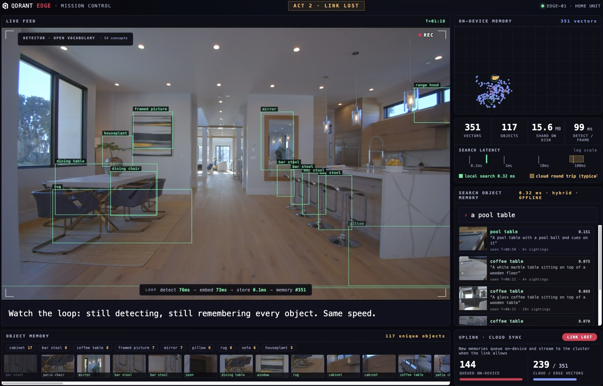

# Qdrant Edge Demo: Robot Object Memory

An interactive demo of [Qdrant Edge](https://qdrant.tech/edge/): an in-process
vector search engine running inside one Python process, with no server and no
network in the loop.



[Watch the full 2:35 demo run](docs/screenshots/edge-demo.mp4): detection,
search, link loss, live teaching, and reconnect, end to end.

A home robot patrols a house. Every object it sees becomes an individual,
searchable memory, entirely on the device:

- **YOLOE** (open vocabulary) detects and tracks every object in view.
- **SigLIP2** embeds each confirmed object and each frame into one
  cross-modal space.
- **Florence-2** captions every object asynchronously ("a chrome bar stool
  sitting on top of a wooden floor").
- **Qdrant Edge** stores it all in a shard that is a folder, not a server:
  dense vision vectors, sparse BM25 vectors over the captions, payload
  indexes, and facets.

Searches are hybrid queries (dense + BM25 fused with reciprocal rank fusion)
that run in well under a millisecond, on-device, even with the network cut.

While the 2:33 patrol plays, you drive:

- **Search the robot's object memory.** Type anything you remember from the
  feed ("wine bottles on a tray") and press Enter, or use the suggestion
  chips. Results are objects: the crop, its caption, when it was seen, plus
  full-frame moments. Weak matches are dimmed and flagged.
- **Watch the inventory grow.** Every discovered object lands in the Object
  Memory rail with live per-class facet counts, computed by the shard. Click
  a facet to query that class.
- **Cut the uplink.** Press Cut Link and watch the loop keep running at full
  speed while the sync queue grows on-device. Search still works offline.
  Restore the link and the cloud catches up in seconds.
- **Teach a concept.** Type a phrase into the detector HUD ("a surfboard")
  and the robot starts detecting it immediately: one text embedding, applied
  live in about 300 ms, no retraining.
- **Explore the memory map.** Blue dots are frame memories, amber dots are
  objects; hover to see what each one remembers.

After the mission ends the memory stays searchable; Replay Mission starts a
fresh run. Append `?auto` to the URL for a self-playing scripted version
suited to screen recording.

Everything on screen is real work: real detections, real embeddings, real
captions, a real Edge shard answering hybrid queries, real measured latency,
a real Qdrant server receiving the sync. The only theater is the uplink kill
switch. The cloud round-trip band on the latency strip is a labeled typical
range, not a measurement.

## Requirements

- [uv](https://docs.astral.sh/uv/) (Python 3.11–3.13 managed automatically)
- ffmpeg (`brew install ffmpeg`)
- Docker, to run the Qdrant server that plays the "cloud" cluster
- Chrome or any modern browser
- Apple Silicon recommended (the detector and captioner run on MPS). The
  whole pipeline runs at about 1.5x realtime on an M-series CPU/GPU with no
  discrete GPU needed.

## Setup (One Time, ~15 Minutes)

```bash
docker run -d -p 6333:6333 qdrant/qdrant   # the "cloud" cluster (required)
make setup      # python deps + models (~3 GB: SigLIP2, YOLOE, Florence-2)
make footage    # download the 9 source clips from Pexels (~160 MB)
make prepare    # stitch mission.mp4, fit the memory map, verify retrieval
```

`make prepare` ends by running the full object pipeline offline and checking
that every scripted query retrieves the right objects from the right part of
the footage; it fails loudly if retrieval is off.

## Running the Demo

```bash
make run
```

Open http://localhost:8000, make the window full screen, and press Space or
click when the title card says "press space or click to begin". If the title
card says "connecting", the server is still warming the models (~40 s after
launch).

The demo expects the Qdrant container on `localhost:6333` (see `CLOUD_URL` in
`app/constants.py`); it creates and overwrites a collection named
`edge_mission_demo`. Without a reachable Qdrant server the demo will not start.

Between runs: use Replay Mission, or restart the server (`make run` wipes all
demo state) and reload the page.

## Verifying Changes

- `make test` runs a headless full-length pass of the scripted mode and checks
  the event stream (server must be running).
- `uv run python scripts/test_objects.py` runs the real pipeline offline
  (no server) and checks object retrieval for every scripted query. Use
  `--seconds 35` for a quick pass while iterating.
- `uv run python scripts/capture_run.py` drives a full scripted run in headless
  Chrome and saves per-act screenshots to /tmp/edge-shots. One-time setup:
  `uv run playwright install chromium`.

## How It Works

One ingest tick (3 per second of mission time):

1. `detector.py` runs YOLOE-11L with a ~50-term household vocabulary,
   tracking every detection across frames (BoT-SORT). ~80–120 ms on MPS.
2. `pipeline.py` embeds the whole frame with SigLIP2 and upserts it as a
   `kind=frame` point. ~30 ms.
3. `registry.py` confirms a track into an object identity after 3 sightings:
   it picks the best crop seen so far (confidence × size × sharpness), embeds
   it, and either merges it into a known object (cosine re-id across camera
   cuts) or upserts a new `kind=object` point.
4. `captioner.py` captions new objects on a background thread with
   Florence-2-base (~0.2 s each). The caption lands in the object's payload
   and as a sparse BM25 vector, built and stored inside the Edge shard.

A query embeds the text once with SigLIP2, then runs two prefetches inside
the shard (dense cosine over crops, BM25 over captions), fuses them with
reciprocal rank fusion, and returns scored objects with payloads. A second
MMR query returns diverse full-frame moments. Both run in-process; no
network, no server, no IPC.

## Layout

- `app/session.py` owns a run: shard, sync worker, pipeline, query path.
- `app/pipeline.py` is the live loop: capture, detect, embed, upsert, paced
  to video time.
- `app/detector.py` wraps YOLOE: open-vocabulary detection + tracking, live
  vocabulary extension.
- `app/registry.py` turns tracks into persistent object identities.
- `app/captioner.py` is the async Florence-2 enrichment worker.
- `app/edge_store.py` wraps the Edge shard: dense + sparse vectors, hybrid
  RRF queries, payload indexes, facets.
- `app/cloud_sync.py` queues points on-device and syncs them to the cluster
  when the link is up.
- `app/director.py` is the `?auto` mode script: timeline, captions, queries.
- `app/constants.py` holds the tunables: detector vocabulary, confirmation
  thresholds, ingest rate, cloud URL.
- `static/` is the mission-control UI (vanilla JS, three canvases,
  WebSocket-driven).
- `scripts/` holds footage prep and the test harnesses.

## Customizing

- Detector vocabulary: edit `DETECTOR_VOCAB` in `app/constants.py` (or teach
  concepts live from the HUD).
- Scripted timeline (auto mode): edit `TIMELINE` in `app/director.py`.
  Validate new queries with `scripts/test_objects.py` before relying on them.
- Different footage: drop clips into `footage/`, list them with trim points in
  `CLIPS` in `scripts/prepare_footage.py`, then `make prepare`. The pipeline
  is source-agnostic; anything OpenCV can read works.

Footage: nine walkthrough clips of one home by Kindel Media (living room,
dining, kitchen, game room, hallway, bedroom, bathroom, patio, backyard), free
for commercial use under the [Pexels License](https://www.pexels.com/license/),
stitched to 1080p30.

Models: YOLOE-11L-seg via Ultralytics (AGPL-3.0) for detection,
`florence-community/Florence-2-base` (MIT) for captions, SigLIP2-base ONNX
(Apache-2.0) for embeddings. About 3 GB total, all running locally.
